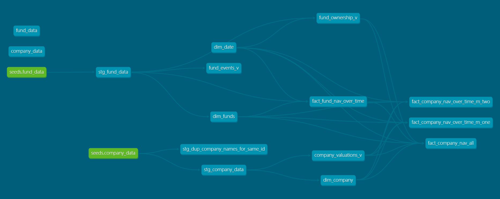

# Task 1

### Discussion Points
- From a technical standpoint, what are your observations about the data extract?
- What potential challenges might arise when working with this data?
- Can you identify any data quality issues or inconsistencies?
- If you were responsible for designing this data extract, what additional information would you include to improve usability?
- What would the end-to-end pipeline look like for ingesting this data into a Snowflake data warehouse?

## 1.1 Technical observations
The extract combines event-level transactions (commitments, calls, distributions, valuations) with static attributes (fund size, sector, region). Dates are stored as strings in DD/MM/YYYY format, `transaction_type` is free-text, and `transaction_index` is inconsistently numeric. There are no clear surrogate keys, so uniqueness has to be inferred from natural keys (e.g. fund name + date). Static attributes such as fund size drift over time without effective dating.

## 1.2 Potential challenges
Because the extract is event-oriented, it is not an ideal single source for building dimensions; reference information for funds, companies, and geographies should come from a more authoritative source. Joins rely on free-text identifiers (fund name, company ID), which are error-prone. Inconsistent formats and missing attributes complicate transformation, and outliers such as ownership percentages greater than 100% can occur if fund sizes are not kept in sync with commitments.

## 1.3 Data quality issues
- Country values appear in multiple formats (e.g. `USA` vs `United States`).
- `transaction_index` appears as both integers and floating-point numbers.
- `region`, `country`, and `sector` are missing for some companies.
- Dates must be parsed from strings and may fail if formats vary.
- Fund size values vary across rows without clear effective dating.

## 1.4 End-to-end pipeline
Transaction-related event data could be streamed into Snowflake and, based upon the latency requirements, it’s either:
- dbt-transformed to look up the reference data, or  
- Spark-transformed on the fly to supply near real-time enriched dataset.  

This works only if IDs can be supplied with the event records and those IDs can be looked up from another system that is integrated into Snowflake.

---

# Task 2

## 2.1 Additional considerations
- Some dates in the extract contain multiple valuations, but their significance is unclear. The user has confirmed that their Excel output is correct but is unsure how these multiple valuations should be handled.
- Clearly document any assumptions you make about data treatment in your SQL solution.

*This is essentially the same logic as my `fact_fund_nav_over_time` model, but restricted to transaction dates only.*

### Assumptions about data treatment
- **Multiple valuations on the same fund/date**  
  If more than one valuation exists for the same fund on the same date, keep the highest valuation.  
  *Rationale*: this avoids understating NAV. Alternatively, if a business rule exists for `transaction_index` ordering, that should be applied instead.

- **Flows relative to valuation dates**  
  `CALLS` are treated as positive inflows, `DISTRIBUTIONS` as negative.  
  Flows are included if they occur after the valuation date and up to (and including) the report date.  
  Flows on the same day as a valuation are excluded from that valuation date and will impact NAV from the following day onwards.

- **Report dates**  
  The NAV series is reported only on transaction dates (valuation or flow dates), consistent with the Excel example provided.  
  If a full daily NAV is required, this logic could be applied to a date spine (e.g., `dim_date`).

- **Data parsing and cleansing**  
  Dates are assumed to be in DD/MM/YYYY format and parsed accordingly.  
  Transaction amounts are cast to numeric; invalid values are treated as null.  
  Fund names are trimmed and uppercased to ensure consistent matching.

## 2.2 Company-level NAV
The user now wants to see the same NAV calculation at the company level:
- The `company_data` table represents the total valuation of companies held by the funds.
- Since CVC only owns a fraction of each fund, the company valuations should be scaled down based on CVC's ownership of the fund.
- The `fund_size` represents the latest size of the fund, not the fund size at the time of the transaction.

New fact models:
- `fund_ownership_v` → computes ownership% per fund as of each date = (cumulative COMMITMENTs up to that date) ÷ latest `fund_size`.
- `fact_company_nav_over_time_m_one` → joins company valuations to `fund_ownership_v` on the same date and calculates Company NAV = Ownership × Company Valuation.

## 2.3 SQL requirement
Considering only dates where you have both a fund-level NAV and a set of company valuations, write an SQL query to calculate the company NAV over time using this new scaling method.

`fact_company_nav_over_time_m_two` model

## 2.4 Method comparison
In **Method 1**, we scale company valuations by our ownership percentage (commitments ÷ latest fund size).  
In **Method 2**, we rescale company valuations so they always add up to the fund NAV.

**Method 1:**
- Answers: *“What is our legal share of these companies given our commitments?”*  
- NAV = Company Valuation × (Cumulative Commitments ÷ Latest Fund Size).  
- Produces fewer rows — only where commitment data is available.  
- NAV may be understated or overstated if the latest fund size is out of sync with historic commitments.  
- Residuals like “Other Assets” can appear.

**Method 2:**
- Answers: *“How should we allocate the fund’s NAV across its companies for reporting?”*  
- NAV = Company Valuation × (Fund NAV ÷ Sum of Company Valuations).  
- Produces more rows — every date where fund NAV and company valuations co-exist.  
- Ensures reconciliation: company NAVs always sum to the fund NAV.  
- Company NAVs differ from Method 1 due to timing gaps, cash, fees, or differences in NAV vs raw company valuations.

**Why they differ:**
- Timing: Method 2 forces NAV and valuations into alignment; Method 1 does not.  
- Scope: Method 1 reflects legal ownership ratio; Method 2 reflects accounting reconciliation.  
- Residuals: Method 1 may leave unexplained residuals; Method 2 redistributes everything across companies.

---

# Task 3

## 3.1 dbt tests
Write dbt tests to identify the following data quality issues:

1. Invalid `transaction_date`  
2. Missing `fund_name`, `fund_size`, `transaction_type`, `transaction_index`, `transaction_date`, or `transaction_amount`  
3. Duplicate companies sharing the same `company_id`  

**Suggested approach:**  
In addition to the not-nulls and accepted values we already test, add checks for valid date formats, numeric ranges, and reconciling NAVs. For example:
- Test that transaction amounts parse correctly as numbers.
- Test that company NAVs in Method 2 actually sum back to the fund NAV.

**Monitoring:**  
Automate these tests in dbt or Snowflake so they run on every pipeline execution, then surface results in a dashboard or Slack alert. This allows tracking of test failures, data freshness, and anomalies (e.g., sudden spikes or missing rows).

**Edge cases to watch for:**
- Multiple valuations on the same date  
- Flows on the same day as a valuation  
- Ownership percentages > 100% due to stale fund size  
- Duplicate company IDs  

